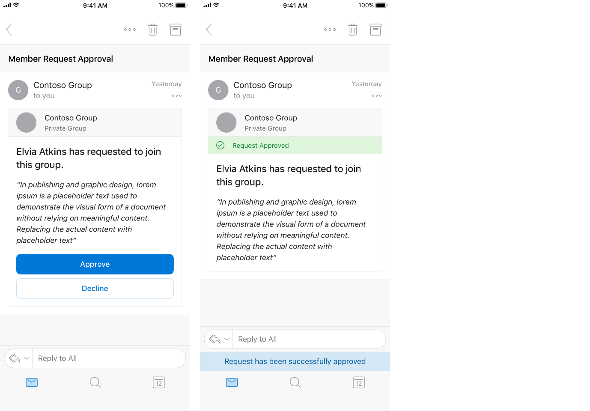
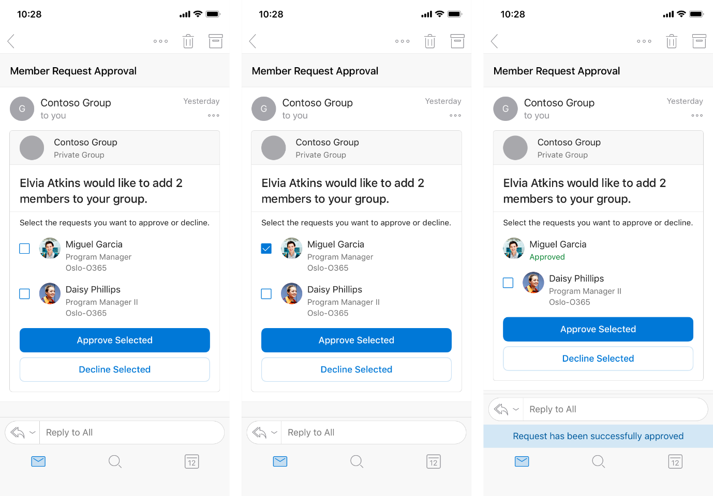
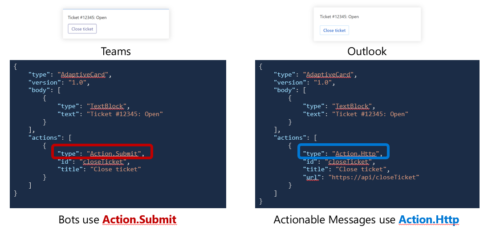
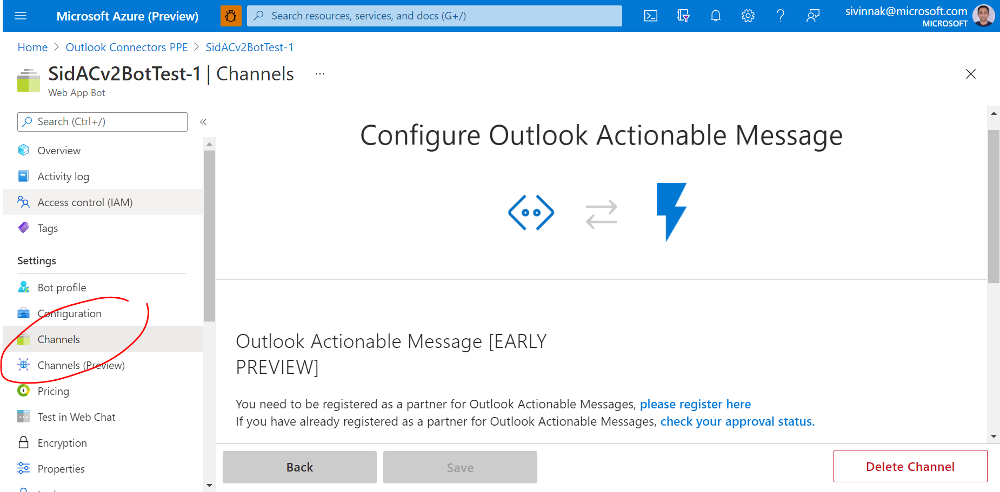
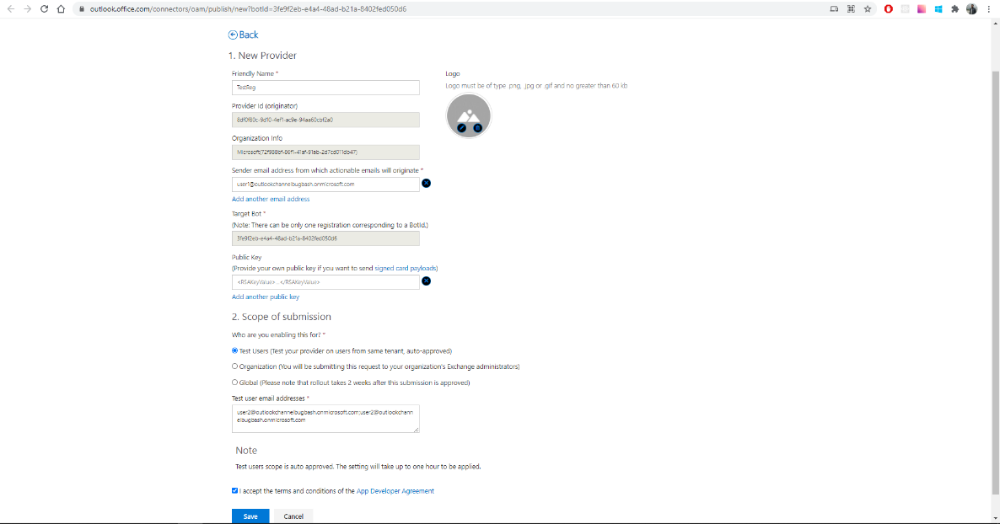
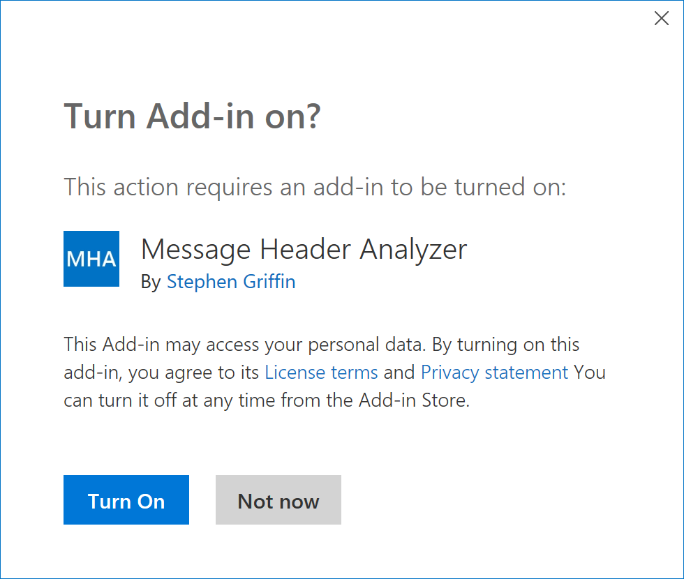
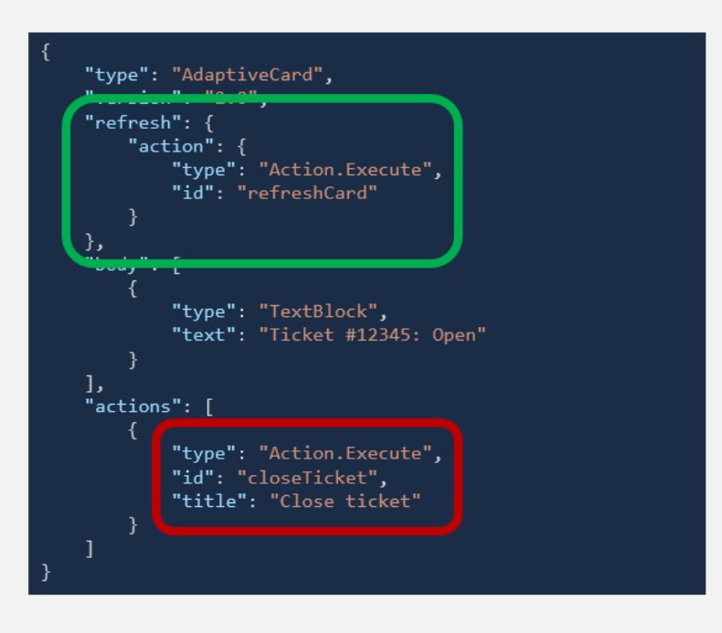

# **Actionable messages in Outlook and Office 365 Groups**

Whether you are filling out a survey, approving an expense report, or updating a CRM sales opportunity, Actionable Messages enable you to take quick actions right from within Outlook. Developers can now embed such actions in their emails, elevating user engagement with their services and increasing organizational productivity.

Office 365 enables you enhance productivity with Outlook Actionable Messages, which are dynamic emails with embedded action requests.

**Note**

Actionable messages are also available in Microsoft Teams. Even better, you can build a single integration that delivers action requests across Outlook and Teams. See [**Universal Actions for Adaptive Cards**  ](https://docs.microsoft.com/en-us/microsoftteams/platform/concepts/connectors/connectors)for more information.

**User experience**

Let&#39;s take a look at the end-to-end user experience for an actionable email.

**Actionable messages via email: group membership request approval scenario**

A Contoso employee submits a request to join a private Office 365 group. Office 365 sends an Actionable Message to the person who owns the group to approve or decline the request. The card included in the message contains all the information the approver might need to quickly understand who submitted the request and any message they included to explain their request. It also includes  **Approve**  and  **Decline**  actions that can be taken right from Outlook. The owner approves the request, and the card updates to indicate the outcome.



The new member of the group submits a second request to add her team members to the group. Office 365 sends an Actionable Message to the owner with clear information about who submitted the request and the new members to add. The recipient can approve all, some, or none of the proposed new members. The owner approves one new member, and the card updates to indicate the outcome. The approved member is no longer selectable, while the remaining member remains selectable.



The owner declines the other requested new member, and the card updates to indicate the outcome. Both members are no longer selectable, and the action buttons are removed.


**Outlook version requirements for actionable messages**

Actionable messages are available to all customer mailboxes on Exchange Online in Office 365 or Outlook.com with a supported client. The following table lists the availability of actionable messages for current Outlook clients. For information on the Office 365 release channels, see [Overview of update channels for Office 365 ProPlus](https://docs.microsoft.com/en-us/DeployOffice/overview-of-update-channels-for-office-365-proplus).

| **OUTLOOK VERSION REQUIREMENTS FOR ACTIONABLE MESSAGES** |
| --- |
| **Client** | **Actionable messages via Adaptive Cards supported?** | **Adaptive card version supported** |
|
| |
|
| |
| Outlook on the web for Office 365 | Yes | 1.4 |
| --- | --- | --- |
| Office 365 ProPlus Monthly Channel | Yes, in version 1805, Build 9330 | 1.0(Support for version 1.4 coming soon) |
| --- | --- | --- |
| Office 365 ProPlus Semi-Annual Channel (Targeted) | Yes, in version 1808, Build 10730.20262 | 1.0(Support for version 1.4 coming soon) |
| --- | --- | --- |
| Office 365 ProPlus Semi-Annual Channel | Yes, in version 1808, Build 10730.20264 | 1.0(Support for version 1.4 coming soon) |
| --- | --- | --- |
| Outlook 2016 on Mac | Yes, in version 16.38, Build 20060702 | 1.4
Yes, in version 16.49, Build 21050901 |
| --- | --- | --- |
| Outlook on iOS | Yes | 1.4 |
| --- | --- | --- |
| Outlook on Android | Yes | 1.4 |
| --- | --- | --- |
| Office Professional Plus 2016 (Click-to-Run only) | Actionable Messages are available for Office 365 only | NA |
| --- | --- | --- |
| Exchange 2016 On-Premises Outlook on the web | Actionable Messages are available for Office 365 only | NA |
| --- | --- | --- |

**Note**

Currently actionable message cards do not change the way that they render when Outlook is in dark mode when adaptive cards version 1.4 is used. Support for dark mode for actionable messages for adaptive cards v1.4 is coming soon.

# **Universal Actions for Actionable Messages in Outlook and Teams**

With Universal Actions, M365 developers can now implement scenarios once and run them seamlessly on both Teams and Outlook. Furthermore, the new Universal Action model also brings the following improvements:

Features that were previously only available in Outlook Actionable Messages, such as automatic card updates and the ability for actions to refresh the current card, are now also available in Teams

Outlook Actionable Messages now support Adaptive Cards v1.4 and with it exciting new features such as RichTextBlock and Input Validation

To better understand how Universal Actions work, let&#39;s look at the current situation and what is new with Universal Actions. Adaptive Cards designed to run in Teams must use the **Action.Submit** action type, while cards authored to run in Outlook must use the **Action.Http** action type.



The [**Universal Action Model**](https://docs.microsoft.com/en-us/adaptive-cards/authoring-cards/universal-action-model) introduces the new [**Action.Execute**](https://adaptivecards.io/explorer/Action.Execute.html) action type that seamlessly works in both Teams and Outlook. This allows developers to:

- Send the same Adaptive Card to both Teams and Outlook
- Implement and maintain a single backend service to handle action execution, whether end-users are taking those actions from Teams or Outlook.

In other words, the Universal Actions model enables a true build once, deploy and run everywhere experience. The graphic below illustrates the same.


To make all this work, the Universal Actions model relies on the Bot Framework to call the backend services that handle actions. Bot Framework is a standardized solution that comes with rich tooling, SDKs and documentation.

Universal Actions empower Microsoft 365 users by enabling seamless synchronization and inter-operability between Outlook emails and Teams chat messages that embed Adaptive Cards. This allows end-users to be more productive, collaborate better, and have consistent experiences across canvases.

**Outlook version requirements for universal actions**

The following table lists the availability of actionable messages backed by Universal Actions for current Outlook clients.

| **OUTLOOK VERSION REQUIREMENTS FOR ACTIONABLE MESSAGES** |
| --- |
| **Client** | **Universal Actions Supported?** | **Adaptive card version supported** |
|
| |
|
| |
| Outlook on the web for Office 365 | Yes | 1.4 |
| --- | --- | --- |
| Office 365 ProPlus Monthly Channel | Coming Soon | 1.0 |
| --- | --- | --- |
| Office 365 ProPlus Semi-Annual Channel (Targeted) | Coming Soon | 1.0 |
| --- | --- | --- |
| Office 365 ProPlus Semi-Annual Channel | Coming Soon | 1.0 |
| --- | --- | --- |
| Outlook 2016 on Mac | Yes, in version 16.49, Build 21050901
 | 1.4 |
| --- | --- | --- |
| Outlook on iOS | Yes | 1.4 |
| --- | --- | --- |
| Outlook on Android | Yes | 1.4 |
| --- | --- | --- |
| Office Professional Plus 2016 (Click-to-Run only) | Actionable Messages are available for Office 365 only | NA |
| --- | --- | --- |
| Exchange 2016 On-Premises Outlook on the web | Actionable Messages are available for Office 365 only | NA |
| --- | --- | --- |

# **Get started with actionable messages in Office 365**

Actionable messages backed by Universal Actions can be sent using the following mechanisms:

1. Directly over email
2. Via email channel for an Azure Bot

Choosing the right delivery mechanism depends on your scenario.

**Note**

Office 365 administrators can disable actionable messages via the [**Set-OrganizationConfig cmdlet**](https://docs.microsoft.com/en-us/powershell/module/exchange/organization/set-organizationconfig). If actionable messages do not render, check with your administrator to make sure the feature is enabled in your organization.

**Choosing a delivery mechanism**

Several applications including line-of-business solution send system generated emails to users that are business critical and requires the user to complete a task. Today, users complete these tasks by visiting a website or switching to another application. This hinders user productivity due to context switching and the extra steps required to complete that task. Examples include expense approvals, bill pay, etc. These are great candidates for enabling actions within the email itself.

Similarly, Azure Bot for an application can also notify users via email by adding email as a channel for the bot. When an event in the application needs a user to take an action or complete an action, the bot can trigger an email notification the user. Embedding actions within this email boosts productivity and improves TAT for business-critical scenarios.

These approaches may not be necessarily mutually exclusive, as you may choose to use multiple solutions for enabling actionable messages from your service. For example, a CRM system may generate an approval email for authorizing a sales discount by a manager, thus enabling an actionable message via email. Consider other scenarios where users or teams want to be notified of important changes to opportunities, leads or accounts they manage. In these cases, a user may update the stage of an opportunity or lead, or set the close date depending on the notification they get. Office connectors or Azure bot-based notifications are a great way to accomplish these scenarios.

Once you&#39;ve decided which delivery method is best for your scenario, you&#39;re ready to start trying some examples.

- [Designing Actions and Inputs](https://docs.microsoft.com/en-us/outlook/actionable-messages/adaptive-card)
- [Actionable Messages via Email](https://docs.microsoft.com/en-us/outlook/actionable-messages/send-via-email)
- [Actionable Messages via Bots](https://docs.microsoft.com/en-us/outlook/actionable-messages/send-via-connectors) [this exampled needs to be created]

# **Send an actionable message via email in Office 365**

**Supported scenarios**

Sending actionable messages via email is supported in the following scenarios.

- The recipient must be an individual, not a group.
- The recipient must be visible on the message. Do not put the recipient in the BCC field.
- The recipient must have a mailbox on Outlook.com or Exchange Online in Office 365.

**Register as a partner for sending actionable messages**

Start by creating an Azure Bot or using your existing bot. In the settings pane you will see channels, clicking on it will show all channels available for this bot. Select Outlook Actionable Message channel, it should open as shown below.



Once this channel opens, please click on &quot;please register here&quot; to open the Outlook Actionable Messages publisher dashboard. Please fill in all the details and hit save.



This will redirect back to the Azure portal page where you can save the channel.

**Create an actionable message card**

The next step is to create an actionable adaptive card. Let&#39;s start with something simple, just a basic card with an Action.Execute action and an Action.OpenUrl action. We&#39;ll use the [Adaptive Cards Designer ](https://adaptivecards.io/designer/)to design the card. You can then send this card to yourself from the [Actionable Messages Designer](http://amdesigner.azurewebsites.net/) tool.

  **Important**

The sample card markup in this topic omits the originator property. This works in a testing scenario, where the recipient is the same as the sender. When sending actionable messages to anyone else, the originator property must be set to a valid provider ID generated by the process mentioned in the previous section. Leaving this property empty when sending to recipients other than yourself results in the card being removed.

Go to the Card Playground and paste in the following JSON:

JSONCopy
```
{
    "type": "AdaptiveCard",
    "body": [
        {
            "type": "TextBlock",
            "text": "Hello!",
            "size": "Large",
            "color": "Accent"
        },
        {
            "type": "ActionSet",
            "actions": [
                {
                    "type": "Action.Execute",
                    "title": "Click Me!",
                    "verb": "click",
                    "data": {}
                },
                {
                    "type": "Action.OpenUrl",
                    "title": "Learn More",
                    "url": "https://docs.microsoft.com/outlook/actionable-messages"
                }
            ]
        }
    ],
    "$schema": "http://adaptivecards.io/schemas/adaptive-card.json",
    "version": "1.4"
}

```

Feel free to experiment with this simple example in the playground. You can see the [adaptive card reference](https://docs.microsoft.com/en-us/outlook/actionable-messages/adaptive-card) for details on the available fields. Once you have a card you&#39;re happy with, you can move on to sending it.

**Sending actionable messages via email**

  **Important**

You can design and test actionable messages by using the [**Adaptive**  **Cards Designer**](https://adaptivecards.io/designer/), which allows you to design actionable message cards. You can use [**Actionable Messages Designer**](https://amdesigner.azurewebsites.net/) tool to send actionable messages to yourself. You can also send actionable messages to yourself using the [**Office 365 SMTP server**](https://support.office.com/article/pop-and-imap-email-settings-for-outlook-8361e398-8af4-4e97-b147-6c6c4ac95353). You will be unable to send actionable messages to any other user until you have registered by adding &quot;Outlook Actionable Messages&quot; channel to your Azure Bot.

To embed an actionable message card in an email message, we need to wrap the card in a \&lt;script\&gt; tag. The \&lt;script\&gt; tag is then inserted into the \&lt;head\&gt; of the email&#39;s HTML body.

  **Note**

Because the card JSON must be wrapped in a \&lt;script\&gt; tag, the body of the actionable message email MUST be HTML. Plain-text messages are not supported.

1. Add the hideOriginalBody attribute to control what happens with the body of the email. In this case we&#39;ll set the attribute to true so that the body will not be shown.

JSONCopy
```
{
    "type": "AdaptiveCard",
    "hideOriginalBody": true,
    "body": [
        {
            "type": "TextBlock",
            "text": "Hello!",
            "size": "Large",
            "color": "Accent"
        },
        {
            "type": "ActionSet",
            "actions": [
                {
                    "type": "Action.Execute",
                    "title": "Click Me!",
                    "verb": "click",
                    "data": {}
                },
                {
                    "type": "Action.OpenUrl",
                    "title": "Learn More",
                    "url": "https://docs.microsoft.com/outlook/actionable-messages"
                }
            ]
        }
    ],
    "$schema": "http://adaptivecards.io/schemas/adaptive-card.json",
    "version": "1.4"
}

```

1. Wrap the resulting JSON in a \&lt;script\&gt; tag of type application/adaptivecard+json.

HTMLCopy
```
<script type="application/adaptivecard+json">{
  "type": "AdaptiveCard",
  "version": "1.0",
  "hideOriginalBody": true,
  "body": [
    {
      "type": "TextBlock",
      "text": "Visit the Outlook Dev Portal",
      "size": "large"
    },
    {
        "type": "TextBlock",
        "text": "Click **Learn More** to learn more about Actionable Messages!"
    },
    {
      "type": "Input.Text",
      "id": "feedbackText",
      "placeholder": "Let us know what you think about Actionable Messages"
    }
  ],
  "actions": [
    {
      "type": "Action.Http",
      "title": "Send Feedback",
      "method": "POST",
      "url": "https://...",
      "body": "{{feedbackText.value}}"
    },
    {
      "type": "Action.OpenUrl",
      "title": "Learn More",
      "url": "https://docs.microsoft.com/outlook/actionable-messages"
    }
  ]
}
</script>

```

1. Generate an HTML document to represent the email body and include the \&lt;script\&gt; tag in the \&lt;head\&gt;.

HTMLCopy
```
<html>
<head>
  <meta http-equiv="Content-Type" content="text/html; charset=utf-8">
  <script type="application/adaptivecard+json">{
    "type": "AdaptiveCard",
    "version": "1.0",
    "hideOriginalBody": true,
    "body": [
      {
        "type": "TextBlock",
        "text": "Visit the Outlook Dev Portal",
        "size": "large"
      },
      {
        "type": "TextBlock",
        "text": "Click **Learn More** to learn more about Actionable Messages!"
      },
      {
        "type": "Input.Text",
        "id": "feedbackText",
        "placeholder": "Let us know what you think about Actionable Messages"
      }
    ],
    "actions": [
      {
        "type": "Action.Http",
        "title": "Send Feedback",
        "method": "POST",
        "url": "https://...",
        "body": "{{feedbackText.value}}"
      },
      {
        "type": "Action.OpenUrl",
        "title": "Learn More",
        "url": "https://docs.microsoft.com/outlook/actionable-messages"
      }
    ]
  }
  </script>
</head>
<body>
Visit the <a href="https://docs.microsoft.com/outlook/actionable-messages">Outlook Dev Portal</a> to learn more about Actionable Messages.
</body>
</html>

```

1. Send a message via SMTP with the HTML as the body.

**Sending the message**

For examples of sending messages, see the following.

- [Send Actionable Message via Microsoft Graph](https://github.com/jasonjoh/send-actionable-message): A sample console app written in C# that sends an actionable message using [Microsoft Graph](https://docs.microsoft.com/en-us/graph/overview).
- [Send Actionable Message via SMTP](https://github.com/tony-zhu/SendActionableMessage): A sample Python script that sends an actionable message using the Office 365 SMTP server. It also includes a sample HTML payload for the actionable message email body.

**Perform actions**

For examples of performing actions, see the following.

- [https://github.com/DDEfromOR/AC2ErrorBot](https://github.com/DDEfromOR/AC2ErrorBot)

**Troubleshooting tools**

- [Actionable Messages Debugger](https://appsource.microsoft.com/product/office/WA104381686): An Outlook add-in that allows developers to inspect the card payload in their actionable messages and identify why the card is not rendering.

# **Invoke an Outlook add-in from an actionable message**

Actionable messages allow the user to take quick actions on an email message or connector card, and Outlook add-ins allow you to extend Outlook to add new features and interactions. Now, with the Action.InvokeAddInCommand action type, you can combine these two types of integrations to create more powerful and compelling experiences. For example, you could:

- Send a welcome message as an actionable email message to new users after they sign up for your service, with an action that allows them to quickly install and start using your add-in.
- Use an add-in for more complex actions (i.e. to present a form to the user), for scenarios where a simple action input would not suffice.
- Pre-populate UI elements in your add-in before presenting UI to the user.

**Action.InvokeAddInCommand**  actions can work with add-ins that are already installed by the user, or they can work with add-ins that are not installed. If the required add-in is not installed, the user is prompted to install the add-in with a single click.

  **Note**

**Action.InvokeAddInCommand**  is not a valid action type within Teams and hence an action button having this command will not be displayed in Teams.

Single-click installation of the required add-in is only supported if the add-in is published in [**AppSource**](https://docs.microsoft.com/en-us/office/dev/store/submit-to-the-office-store).

The following example shows the prompt users see if the add-in is not installed.



**Invoking the add-in**

Actionable messages invoke add-ins by specifying an [Action.InvokeAddInCommand action](https://docs.microsoft.com/en-us/outlook/actionable-messages/adaptive-card#actioninvokeaddincommand) in the message. This action specifies the add-in to invoke, along with the identifier of the add-in button that opens the appropriate task pane.

The required information is found in the [add-in&#39;s manifest](https://docs.microsoft.com/en-us/office/dev/add-ins/outlook/manifests). First, you&#39;ll need the add-in&#39;s identifier, which is specified in the [Id element](https://docs.microsoft.com/en-us/office/dev/add-ins/reference/manifest/id).

XMLCopy
```
<?xml version="1.0" encoding="UTF-8" standalone="yes"?>
<OfficeApp
  xmlns="http://schemas.microsoft.com/office/appforoffice/1.1"
  xmlns:xsi="https://www.w3.org/2001/XMLSchema-instance"
  xmlns:bt="http://schemas.microsoft.com/office/officeappbasictypes/1.0"
  xsi:type="MailApp">
  <Id>527104a1-f1a5-475a-9199-7a968161c870</Id>
  <Version>1.0.0.0</Version>
  ...
</OfficeApp>
```
For this add-in, the add-in identifier is 527104a1-f1a5-475a-9199-7a968161c870.

Next, you&#39;ll need the id attribute of the [Control element](https://docs.microsoft.com/en-us/office/dev/add-ins/reference/manifest/control) that defines the add-in button that opens the appropriate task pane. Keep in mind that the Control element MUST:

- Be defined inside a [MessageReadCommandSurface extension point](https://docs.microsoft.com/en-us/office/dev/add-ins/reference/manifest/extensionpoint#messagereadcommandsurface)
- Have its xsi:type attribute set to Button
- Contain an [Action element](https://docs.microsoft.com/en-us/office/dev/add-ins/reference/manifest/action) of type ShowTaskpane

XMLCopy
```
<ExtensionPoint xsi:type="MessageReadCommandSurface">
  <OfficeTab id="TabDefault">
    <Group id="msgReadCmdGroup">
      <Label resid="groupLabel"/>
      <Control xsi:type="Button" id="showInitContext">
        <Label resid="readButtonLabel"/>
        <Supertip>
          <Title resid="readButtonTitle"/>
          <Description resid="readButtonDesc"/>
        </Supertip>
        <Icon>
          <bt:Image size="16" resid="icon-16"/>
          <bt:Image size="32" resid="icon-32"/>
          <bt:Image size="80" resid="icon-80"/>
        </Icon>
        <Action xsi:type="ShowTaskpane">
          <SourceLocation resid="readPaneUrl"/>
          <SupportsPinning>true</SupportsPinning>
        </Action>
      </Control>
    </Group>
  </OfficeTab>
</ExtensionPoint>

```
For this add-in button, the ID is showInitContext.

With these two pieces of information, we can create a basic Action.InvokeAddInCommand action as follows:

JSONCopy
```
{
  "type": "AdaptiveCard",
  "version": "1.4",
  "body": [
    {
      "type": "TextBlock",
      "text": "Invoking an add-in command from an Actionable Message card",
      "size": "large"
    }
  ],
  "actions": [
    {
      "type": "Action.InvokeAddInCommand",
      "title": "Invoke \"View Initialization Context\"",
      "addInId": "527104a1-f1a5-475a-9199-7a968161c870",
      "desktopCommandId": "showInitContext",
      "fallback": "drop"
    }
  ]
}

```
**Passing initialization data to the add-in**

The Action.InvokeAddInCommand action can also provide additional context to the add-in, allowing the add-in to do more than just simply activate. For example, the action could provide initial values for a form, or provide information that allows the add-in to &quot;deep link&quot; to a specific item in your back-end service.

In order to pass initialization data, include an initializationContext property in the Action.InvokeAddInCommand action. There is no set schema for the initializationContext property, you can include any valid JSON object.

For example, to extend the sample action from above, we could modify the action as follows:

JSONCopy
```
{
  "type": "AdaptiveCard",
  "version": "1.0",
  "body": [
    {
      "type": "TextBlock",
      "text": "Invoking an add-in command from an Actionable Message card",
      "size": "large"
    }
  ],
  "actions": [
    {
      "type": "Action.InvokeAddInCommand",
      "title": "Invoke \"View Initialization Context\"",
      "addInId": "527104a1-f1a5-475a-9199-7a968161c870",
      "desktopCommandId": "showInitContext",
      "initializationContext": {
        "property1": "Hello world",
        "property2": 5,
        "property3": true
      }
    }
  ]
}

```
**Receiving initialization data in the add-in**

If your action passes initialization data, the add-in must be prepared to receive it. Add-ins can retrieve initialization data by calling the [Office.context.mailbox.item.getInitializationContextAsync](https://docs.microsoft.com/en-us/office/dev/add-ins/reference/objectmodel/preview-requirement-set/office.context.mailbox.item#methods) method. This should be done whenever the task pane opens or loads a new message.

JavaScriptCopy
```
Office.context.mailbox.item.getInitializationContextAsync(
  function(asyncResult) {
    if (asyncResult.status == Office.AsyncResultStatus.Succeeded) {
      if (asyncResult.value != null && asyncResult.value.length > 0) {
        // The value is a string, parse to an object
        var context = JSON.parse(asyncResult.value);
        // Do something with context
      } else {
        // Empty context, treat as no context
      }
    } else {
      if (asyncResult.error.code == 9020) {
        // GenericResponseError returned when there is
        // no context
        // Treat as no context
      } else {
        // Handle the error
      }
    }
  }
);

```
**Resources**

- [Outlook-Add-In-Actionable-Message sample add-in](https://github.com/OfficeDev/Outlook-Add-In-Actionable-Message)

# **Refresh an actionable message when the user opens it**

Actionable messages allow users to take quick actions on an email message, often based on data presented in the card. However, sometimes data changes after the actionable message has been sent. For example, your service might send an actionable message to multiple approvers asking them to approve or reject a request. One approver approves the request, but the actionable message in the other approver&#39;s mailbox still asks for approval. Now, with the refresh capability supported by adaptive cards backed by Universal Actions, you can communicate with your Azure Bot to retrieve an up-to-date Adaptive Card payload with the latest information when the user opens the email in Outlook.

  **Important**

Refreshing the actionable message when the user opens it has a direct impact on the perceived performance of your actionable message solution. It is crucial that your service that supplies the updated card meet the performance requirements of P95 latency being \&lt;2 secs.

**Using refresh Action**

In order to use this feature, your card must use the [Adaptive Card](https://docs.microsoft.com/en-us/outlook/actionable-messages/adaptive-card) format. The [refresh](https://docs.microsoft.com/en-us/adaptive-cards/authoring-cards/universal-action-model) property is an Outlook-specific property added to the AdaptiveCard type. The Action.Execute model supports a &quot;refresh&quot; type which is client-initiated method of communicating with your Azure Bot to fetch the latest state of your adaptive card.

Please see the following example of the &quot;refresh&quot; syntax to invoke Action.Execute by the host client.



**Crafting the initial Adaptive Card**

When using &quot;refresh&quot; model, it is very important that the initial card included with the message still be valuable to the end user and, ideally, be actionable. The &quot;refresh&quot; action might fail, or network conditions might slow it down, in which case the initial card is all the end user will see.

- **Do not**  send an empty initial card with just a &quot;refresh&quot; block. Such cards will be rejected by the Actionable Message platform.
- **Do not**  send an initial card that is just a placeholder asking the user to wait.
- **Do**  send an initial card that presents the information in its current state, even if that means the user might see outdated data by the time they open your message.

The Web API endpoint with which your Azure Bot communicates for &quot;refresh&quot; must also meet the following additional requirements.

- Requests  **must return within 2 seconds** at the 95th percentile.
- Requests that take longer will be ignored by the client, and the original card will continue to display. The message will still be updated on the server.

On success, the Adaptive Card returned will completely replace the existing card in the email message. If the URL returns an error or times out, the existing card will continue to display.

# Security requirements for actionable messages in Office 365

Securing actionable email is simple and easy. There are security requirements on your service when supporting actionable messages with Office 365. The pre-requisitee for your service to send actionable messages are as follows:

1. If you&#39;re using actionable email, you&#39;ll need to enable [sender verification](https://docs.microsoft.com/en-us/outlook/actionable-messages/security-requirements#sender-verification).
2. Your Azure Bot must be registered with Microsoft.

## Sender verification

Office 365 requires sender verification to enable actionable messages via email. Your actionable message emails must either originate from servers that implement DomainKeys Identified Mail (DKIM) and Sender Policy Framework (SPF), or you must implement [signed cards](https://docs.microsoft.com/en-us/outlook/actionable-messages/security-requirements#signed-card-payloads).

While DKIM and SPF are sufficient for some scenarios, that solution will not work in some situations where emails are sent via an external provider, which can lead to recipients not experiencing the enhanced actionable message. For this reason, we recommend always implementing signed cards which work in all cases and are fundamentally more secure since they do not rely on DNS records.

### Implementing DKIM and SPF

DKIM and SPF are industry standard ways to prove a sender&#39;s identity when sending emails over SMTP. Many companies already implement these standards to secure the emails they are already sending. To learn more about SPF/DKIM and how to implement them, see:

- [DomainKeys Identified Mail (DKIM)](https://tools.ietf.org/html/rfc5585)
- [Sender Policy Framework](https://en.wikipedia.org/wiki/Sender_Policy_Framework)

### Signed card payloads

Actionable messages [sent via email](https://docs.microsoft.com/en-us/outlook/actionable-messages/send-via-email) support an alternative verification method: signing the card payload with an RSA key or X509 certificate. This method is required in the following scenarios:

- SPF/DKIM failure caused by sender setup or recipient tenant set custom security services in front of Office 365 services.
- Your scenario for actionable messages requires sending from multiple email accounts.

To use signed cards, you must register your public key in the [email developer dashboard](https://docs.microsoft.com/en-us/outlook/actionable-messages/email-dev-dashboard), and use the corresponding private key to sign the card.

#### SignedCard

Signed actionable message cards are available when sending via email. Use this format to include a signed card in the HTML body of an email. This payload is serialized in Microdata format appended in the end of HTML body.

HTMLCopy
```
<section itemscope itemtype="http://schema.org/SignedAdaptiveCard">
    <meta itemprop="@context" content="http://schema.org/extensions" />
    <meta itemprop="@type" content="SignedAdaptiveCard" />
    <div itemprop="signedAdaptiveCard" style="mso-hide:all;display:none;max-height:0px;overflow:hidden;">[SignedCardPayload]</div>
</section>

```
Note: Partners who prefer to use the legacy MessageCard entity may create a SignedMessageCard entity in place of a SignedAdaptiveCard.

##### SignedCardPayload

SignedCardPayload is a string encoded by JSON Web Signature (JWS) standard. [RFC7515](https://tools.ietf.org/html/rfc7515) describes JWS, and [RFC7519](https://tools.ietf.org/html/rfc7519) describes JSON Web Token (JWT). Given no claim is required in JWT, JWT libraries can be used to build JWS signature.

Note: The term &quot;JWT&quot; can be used interchangeably in practice. However, we prefer the term &quot;JWS&quot; here.

Here is an example of SignedCardPayload. The encoded Adaptive Card appears in the form of [header].[payload].[signature] as per JWS specification.

Copy
```
eyJhbGciOiJSUzI1NiIsInR5cCI6IkpXVCJ9.eyJzZW5kZXIiOiJzZXJ2aWNlLWFjY291bnRAY29udG9zby5jb20iLCJvcmlnaW5hdG9yIjoiNjVjNjgwZWYtMzZhNi00YTFiLWI4NGMtYTdiNWM2MTk4NzkyIiwicmVjaXBpZW50c1NlcmlhbGl6ZWQiOiJbXCJqb2huQGNvbnRvc28uY29tXCIsXCJqYW5lQGNvbnRvc28uY29tXCJdIiwiYWRhcHRpdmVDYXJkU2VyaWFsaXplZCI6IntcIiRzY2hlbWFcIjpcImh0dHA6Ly9hZGFwdGl2ZWNhcmRzLmlvL3NjaGVtYXMvYWRhcHRpdmUtY2FyZC5qc29uXCIsXCJ0eXBlXCI6XCJBZGFwdGl2ZUNhcmRcIixcInZlcnNpb25cIjpcIjEuMFwiLFwiYm9keVwiOlt7XCJzaXplXCI6XCJsYXJnZVwiLFwidGV4dFwiOlwiSGVsbG8gQWN0aW9uYWJsZSBtZXNzYWdlXCIsXCJ3cmFwXCI6dHJ1ZSxcInR5cGVcIjpcIlRleHRCbG9ja1wifV0sXCJhY3Rpb25zXCI6W3tcInR5cGVcIjpcIkFjdGlvbi5JbnZva2VBZGRJbkNvbW1hbmRcIixcInRpdGxlXCI6XCJPcGVuIEFjdGlvbmFibGUgTWVzc2FnZXMgRGVidWdnZXJcIixcImFkZEluSWRcIjpcIjNkMTQwOGY2LWFmYjMtNGJhZi1hYWNkLTU1Y2Q4NjdiYjBmYVwiLFwiZGVza3RvcENvbW1hbmRJZFwiOlwiYW1EZWJ1Z2dlck9wZW5QYW5lQnV0dG9uXCJ9XX0iLCJpYXQiOjE1NDUzNDgxNTN9.BP9mK33S1VZyjtWZd-lNTTjvueyeeoitygw9bl17TeQFTUDh9Kg5cB3fB7BeZYQs6IiWa1VGRdiiR4q9EkAB1qDsmIcJnw6aYwDUZ1KY4lNoYgQCH\_\_FxEPHViGidNGtq1vAC6ODw0oIfaTUWTa5cF5MfiRBIhpQ530mbRNnA0QSrBYtyB54EDJxjBF1vNSKOeVHAl2d4gqcGxsytQA0PA7XMbrZ8B7fEU2uNjSiLQpoh6A1tevpla2C7W6h-Wekgsmjpw2YToAOX67VZ1TcS5oZAHmjv2RhqsfX5DlN-ZsTRErU4Hs5d92NY9ijJPDunSLyUFNCw7HLNPFqqPmZsw
```
The header in above JWS is:

JSONCopy
```
{
  "alg": "RS256",
  "typ": "JWT"
}

```
The payload in above JWS is:

JSONCopy
```
{
  "sender": "service-account@contoso.com",
  "originator": "65c680ef-36a6-4a1b-b84c-a7b5c6198792",
  "recipientsSerialized": "[\"john@contoso.com\",\"jane@contoso.com\"]",
  "adaptiveCardSerialized": "{\"$schema\":\"http://adaptivecards.io/schemas/adaptive-card.json\",\"type\":\"AdaptiveCard\",\"version\":\"1.0\",\"body\":[{\"size\":\"large\",\"text\":\"Hello Actionable message\",\"wrap\":true,\"type\":\"TextBlock\"}],\"actions\":[{\"type\":\"Action.InvokeAddInCommand\",\"title\":\"Open Actionable Messages Debugger\",\"addInId\":\"3d1408f6-afb3-4baf-aacd-55cd867bb0fa\",\"desktopCommandId\":\"amDebuggerOpenPaneButton\"}]}",
  "iat": 1545348153
}

```
###### Required Claims

| **REQUIRED CLAIMS** |
| --- |
| **Claim** | **Description** |
|
| |
|
| |
| originator | MUST be set to the ID provided by Microsoft during onboarding. |
| --- | --- |
| iat | The time that the payload was signed. |
| --- | --- |
| sender | The email address used to send this actionable message. |
| --- | --- |
| recipientsSerialized | The stringified list of the recipients of the email. This should include all the To/CC recipients of the email. |
| --- | --- |
| adaptiveCardSerialized | The stringified Adaptive Card. |
| --- | --- |

Sample code generating signed card:

- [.NET Sample](https://github.com/tony-zhu/SignedAdaptiveCardSample-dotnet)
- [Node.js Sample](https://github.com/tony-zhu/SignedAdaptiveCardSample-node)

# **Register your service with the actionable email developer dashboard**

To test and publish actionable messages via emails, you need to provide certain information to Microsoft to enable this functionality for emails from your service. This process is baked into adding &quot;Outlook Actionable Messages&quot; channel for your Azure Bot. The actionable messages [developer dashboard](https://aka.ms/publishoam) helps you submit and track status of your submission via the web portal.

  **Note**

You can easily try out actionable messages via email by sending email to yourself with the required markup without any intervention from Microsoft. This would typically be the first step you try out as you dip your toes into this capability. Check out [**these samples**](https://docs.microsoft.com/en-us/outlook/actionable-messages/send-via-email#sending-the-message) to send an actionable message to your mailbox, or use the [**Actionable**  **Messages Designer**](https://amdesigner.azurewebsites.net/) to send an actionable message to yourself.

If you are a developer working with actionable messages via email, you will use the portal for the following cases:

- To test actionable messages from your service to your own mail box or within a group of up to 10 test users that comprise your feature crew
- To publish actionable message from your service so any email user within your organization using Office 365 can receive these specially formatted message (this is typically used for enabling actionable messages from a service that is specific to your organization, like a line-of-business app)
- To publish actionable messages from your service so any email user in Office 365 using your service can receive these specially formatted messages

For all the above cases, you will be submitting certain details to Microsoft, which after being reviewed and approved, will enable actionable messages for your service.

**Dashboard sections**

The developer dashboard is divided into a few logical sections you need to fill out based on the scope you&#39;d like to request Microsoft to enable actionable message from your service.

**Details of your provider**

In this section, you need to supply key details that will allow Office 365 to accept emails with markup from your service as well as URLs that can be invoked via the action buttons from those emails.

The key fields are:

- **Sender email address** : This is one or more static email addresses corresponding to the service that will send out emails with action markup. Example: myservice@contoso.com.
- **Bot ID** : This field get auto-filled with ID of your Azure Bot.
- **Public Key** : If you plan to send actionable messages as Signed Card, then you need to specify the public key corresponding to the private key you will use for signing the card. The format for this field is an [RSAKeyValue element](https://www.w3.org/TR/xmldsig-core/#sec-RSAKeyValue).

XMLCopy

\&lt;RSAKeyValue\&gt;

\&lt;Modulus\&gt;xA7SEU+e0yQ...\&lt;/Modulus\&gt;

\&lt;Exponent\&gt;AQAB\&lt;/Exponent\&gt;

\&lt;/RSAKeyValue\&gt;

For an example of how to get public key XML from a .cert file, see [PublicKey Class](https://docs.microsoft.com/en-us/dotnet/api/system.security.cryptography.x509certificates.publickey#examples).

**Scope of your submission**

In this section, you need to specify at what scope you want to enable actionable message for your service. The applicable scopes are:

- **Test Users** : This enables actionable emails from your service to some of the O365 email users in your organization. This scope is generally used for testing actionable messages integration with few test users that you have specified.
- **Organization** : This enables actionable message from your service to any Microsoft 365 email user within your organization. This scope is typically used for enabling actionable messages from a service that is specific to your organization, like a line- of-business application internal to your organization.
- **Global** : This enables actionable message from your service for any email user in Office 365.

Each of the above are independent steps. i.e. you can pick only one scope for each submission and will be subject to the approval process by Microsoft.

  **Note**

Remember, you can easily try out actionable messages by sending an email to yourself with the required markup without any intervention from Microsoft. You can use the [**Actionable**  **Messages Designer**](https://amdesigner.azurewebsites.net/) to send to yourself without writing any code. This would typically be the first step to try out actionable messages.

**Self-service registration**

Self-service of registrations is available for registrations that use the following scopes.

- **Test Users** : The registration request is auto-approved for your test users you specify. This will enable actionable emails from your service sent to test users.
- **Organization** : This registration request will be sent to your organization&#39;s administrators with  **Exchange administrator**  permissions. Any administrator with those permissions receive an email with submission details and will be able to review and approve your request. If no users have the  **Exchange administrator**  role assigned, users with the  **Global administrator**  role will receive this email instead.

Once the submission is approved, whether auto-approved or by your administrator, it will take up to an hour for the registration to take effect.

For  **My organization**  registrations, the administrator accounts will receive an email and the submitter will also be copied on those emails. This will allow you to reach out to your administrator if you need to provide further clarifications or details. Once the request is approved, the submitter and the administrators will be notified with another email.

After an hour has passed, you can verify if the registration has taken into effect by sending an actionable message from your service to your mailbox or specified test users (for  **Test Users**  scope), or any user mailbox in your organization (for  **Organization**  scope). If an hour has passed and the registration is still not in effect, please contact us by using the feedback link at the top the registration dashboard labeled  **Registration not working?**.

**Test user email addresses**

This section is only applicable when your scope of submission to enable actionable messages is  **Test Users**.

In this section provide a list of Microsoft 365 email users in your organization, separated by a semi-colon (;). This will help you to test your actionable messages integration on a few users, before creating an  **Organization**  or  **Global**  scope submission.

**Contact info**

This section is only applicable when your scope of submission to enable actionable messages is  **Global**.

In this section, you need to provide contact details, so we can reach out to you if we have further questions regarding your submission. All information provided must be valid and accurate.

**Publisher information**

This section is only applicable when your scope of submission to enable actionable messages is  **Global**.

In this section, you need to provide details about your service that will be sending Actionable Messages and related support information, so we can reach out to you or direct customers to your support site. This information will also be used as part of the approval process by Microsoft for your provider.

**Scenario details**

This section is only applicable when your scope of submission to enable actionable messages is  **Global**.

In this section, you need to provide details on the scenario for which users will consume actionable messages from your service and other relevant details. This is to help Microsoft determine that validity and usefulness of the solution provided by your service.

**Verification details**

This section is only applicable when your scope of submission to enable actionable messages is  **Global**.

In this section, you need to provide details for Microsoft to verify the actionable message and the corresponding actions that are invoked from the email sent by your provider/service.

Additionally, send a valid email coming from your production servers (or a server with similar DKIM/SPF/From:/Return-Path: headers) including the markup to onboardoam@microsoft.com. This procedure will enable Microsoft to determine that the solution complies with all the guidelines and requirements listed in Registration Criteria.

- Make sure that the markup is correct prior to sending the email.
- Office 365 removes all markup when forwarding an email. Do not forward the email but send it directly.

**Registration criteria**

There are some things you need to keep in mind when you submit your solution for approval for  **Global**  scope since it can have broad impact to users in Office 365.

**Email sender quality guidelines**

- Emails must be authenticated via DKIM or SPF.
- The top-level domain (TLD) of the SPF check or DKIM signature must match the TLD of your From: email address. For example, if you use From: myservice@contoso.com the DKIM or SPF must be for contoso.com or -.contoso.com.
- Emails must come from a static email address, e.g. myservice@contoso.com.
- Emails must follow the email sender guidelines.
  - See [Sending mail to Office 365](https://docs.microsoft.com/en-us/office365/SecurityCompliance/sending-mail-to-office-365) for Office 365.
  - See [Policies, Practices, and Guidelines](https://sendersupport.olc.protection.outlook.com/pm/policies.aspx) for Outlook.com.
  - See [M3AAWG Sender Best Practices](https://www.m3aawg.org/sites/default/files/document/M3AAWG_Senders_BCP_Ver3-2015-02.pdf) and [ReturnPath Sending Best Practices](https://help.returnpath.com/hc/articles/221634867-Sending-Best-Practices-PDF-) for industry guidelines.
- Consistent history of sending a high volume of mail from your domain (order of hundred emails a day minimum to Office 365) for a few weeks at least.
- A very low rate of spam complaints from users.
- High-fidelity, routine and simple actions available for your service should be used. For more complex interactions, OpenURI actions can be used.
- Actions should be used for transactional mail where a high interaction rate is expected. They should not be used on promotional bulk mail.

**Actions guidelines**

- Label of the button needs to reflect clear action to be taken.
- Action.OpenUrl action must deep link into the specific page associated with the entity/information presented in the actionable message.
- Low failure rate and fast response for services handling action requests.
- Please see [Designing Outlook actionable message cards with the Adaptive Card format](https://docs.microsoft.com/en-us/outlook/actionable-messages/adaptive-card) for additional guidelines on designing actionable messages.

**Approval of your submission**

We will notify you on the email address you provided during your submission, so please ensure you provide the right contact information.
